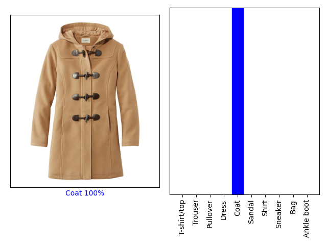
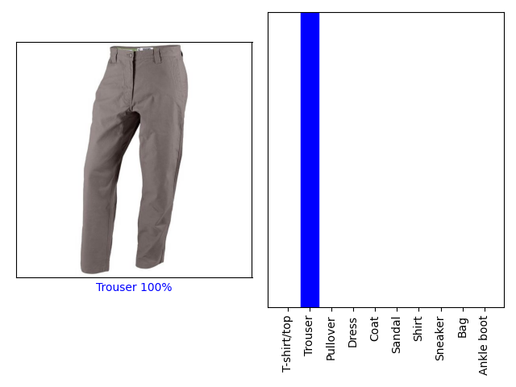
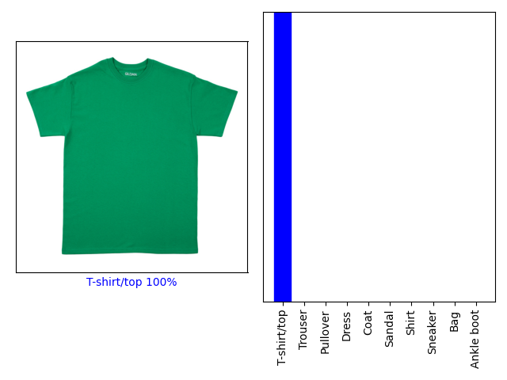
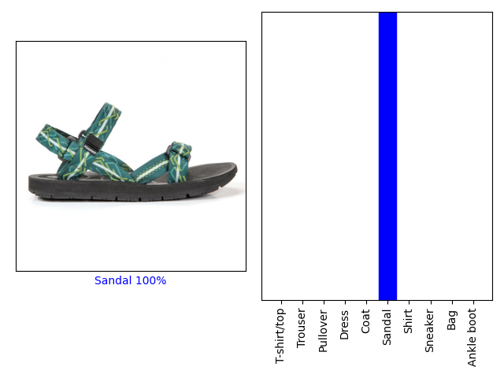

# FashionNeuralNetwork

Neural Network built using TensorFlow that classifies images of clothes into categories such as sneakers, pants, coats, shirts, dresses, sandals, etc. As a extension, I broadened network to be able to classify images off google, rather than just from the dataset. I added foreground processing to remove the background, which improved the network predictions of the clothes.

